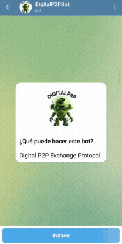

# @Digitalp2pbot

En este sitio encontrarás información sobre [@Digitalp2pbot](https://t.me/DigitalP2PBot). Este es un bot de Telegram para comprar y vender USDT,USDC, de forma P2P, con tu moneda local y sin hacer KYC o entregar datos personales.

## Guía de inicio rápido

1. Descarga una wallet compatible con USDT, USDC ([Wallets recomendadas](./recommended-wallets.md)).
2. Obtén un usuario de Telegram. 
3. Inicia [@DigitalP2PBot](https://t.me/DigitalP2PBot).

    

4. Encuentra ofertas de compra o venta de USDT, USDC en:
- El canal general de ofertas: [@digitalp2porders](https://t.me/digitalp2porders)

    
    
5. Cuando tomes una oferta [@Digitalp2pbot](https://t.me/DigitalP2PBot) te guiará paso a paso en el proceso de compra/venta.
6. Si no encuentras una oferta que te convenga, crea una tú y espera a que alguien la tome.
Escribe en [@DigitalP2PBot](https://t.me/DigitalP2PBot) `/buy` para [comprar USDT USDC](./how-do-i-create-a-buy-order.md), o `/sell` para [vender USDT USDC](./how-do-i-create-a-sell-order.md), de acuerdo a lo que quieras hacer y este te guiará en el proceso. 

7. Comienza a comprar y vender. 
8. Encuentra respuestas a tus dudas en la sección [FAQ](./faq.md).

## Recomendaciones 
- Si tienes alguna duda que no esté respondida en [https://Digitalp2p/aprende](https://digitalp2p.co/aprende/) únete al [grupo de soporte](https://t.me/DigitalP2PChat) y pregunta allí.

- Reporta errores o sugiere mejoras en nuestros [repositorios de GitHub](https://github.com/DigitalP2PBot).

- Síguenos en [X](https://x.com/Digital_P2P) para que no te pierdas los anuncios principales.

