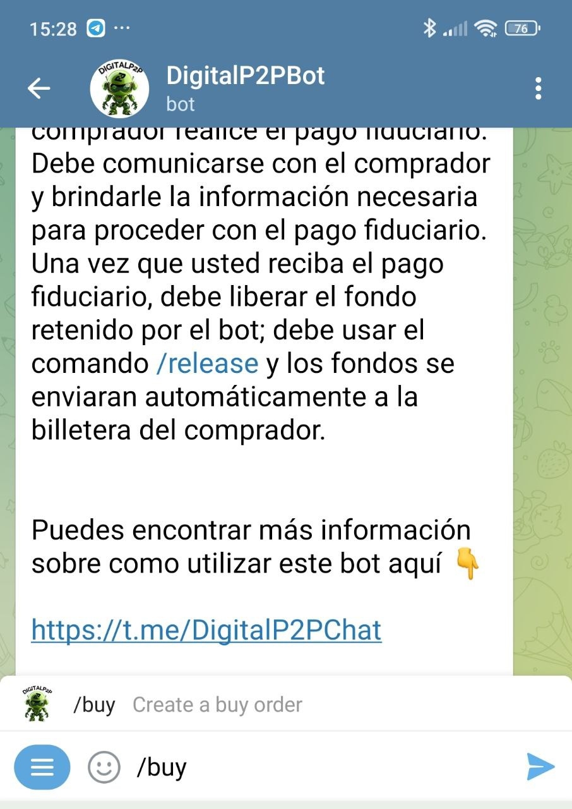
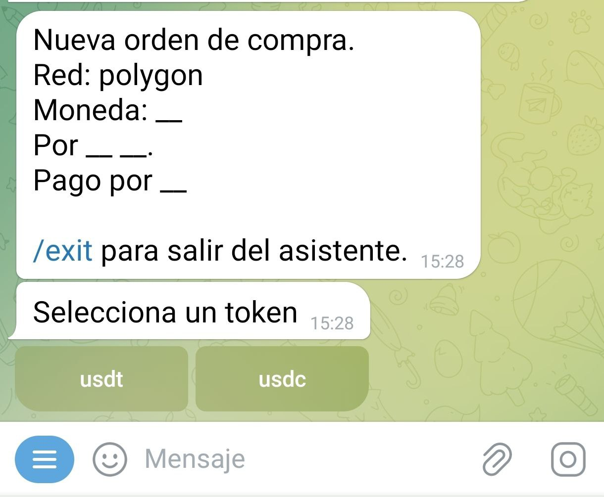
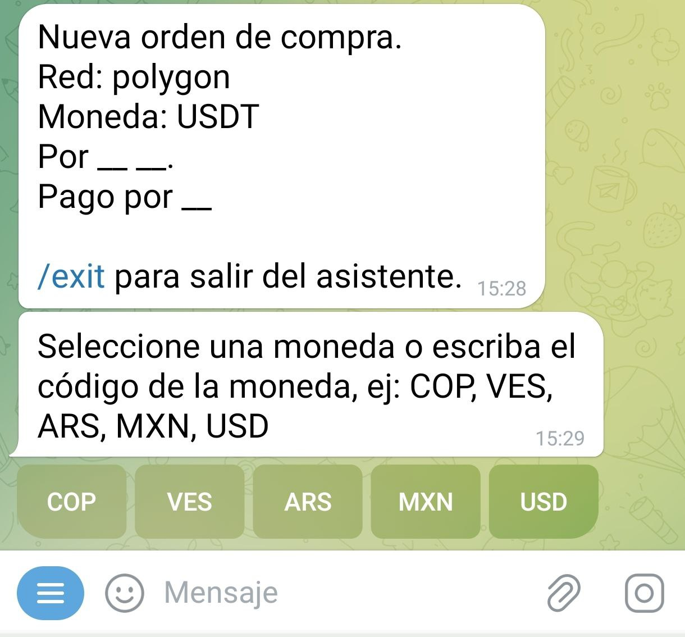
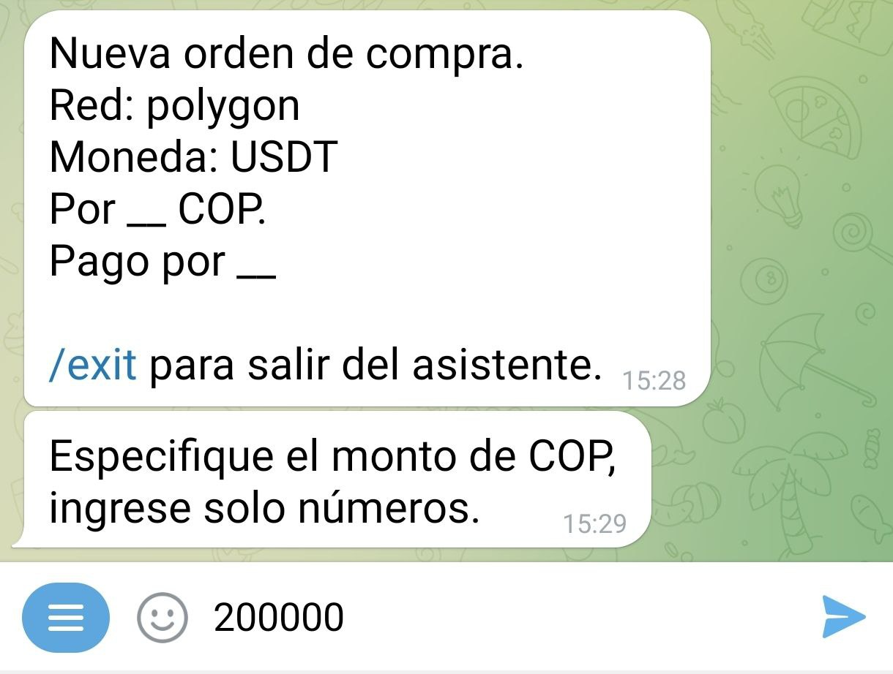
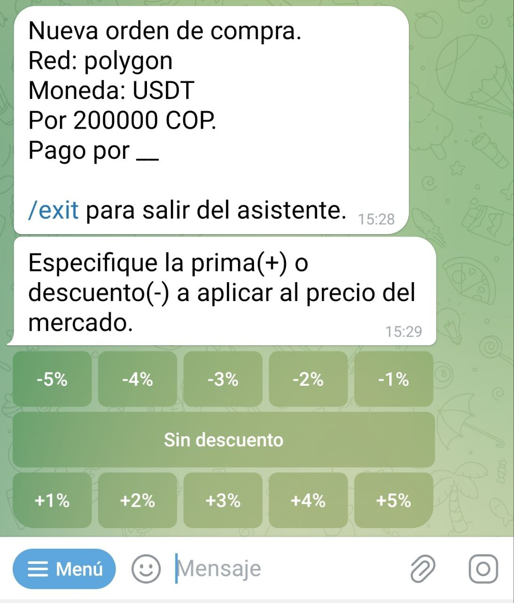
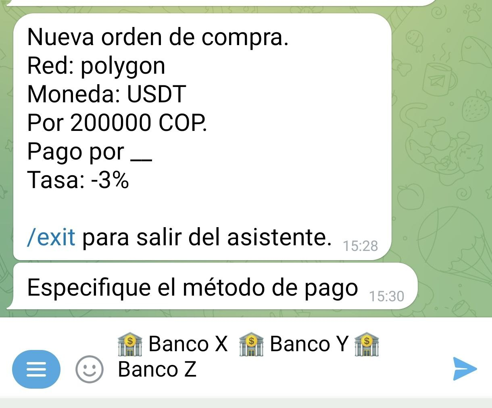
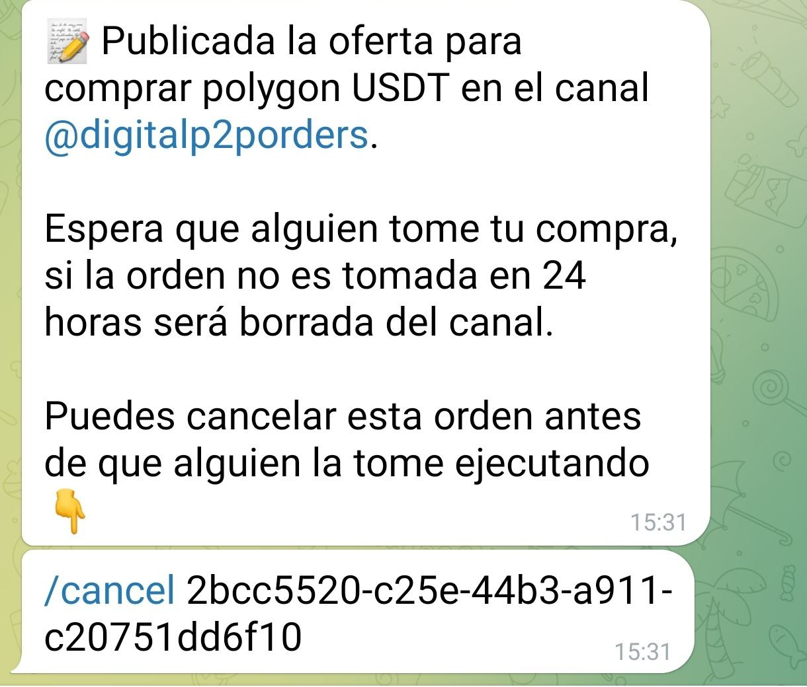
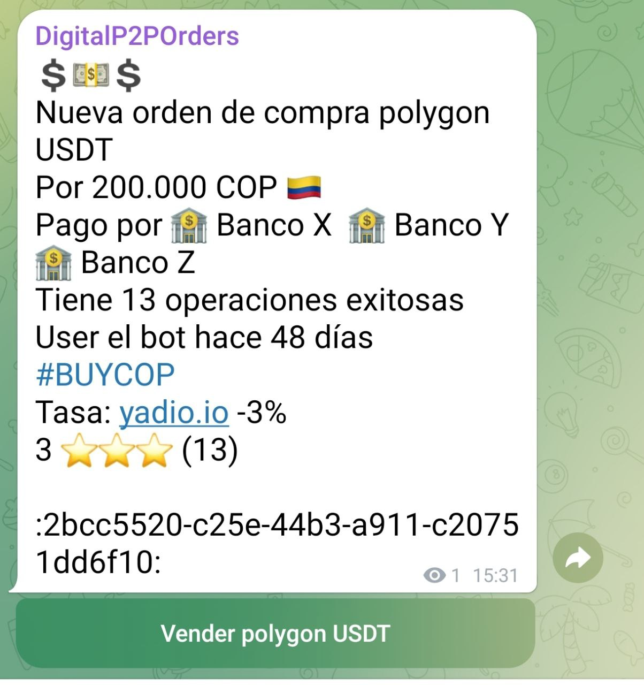
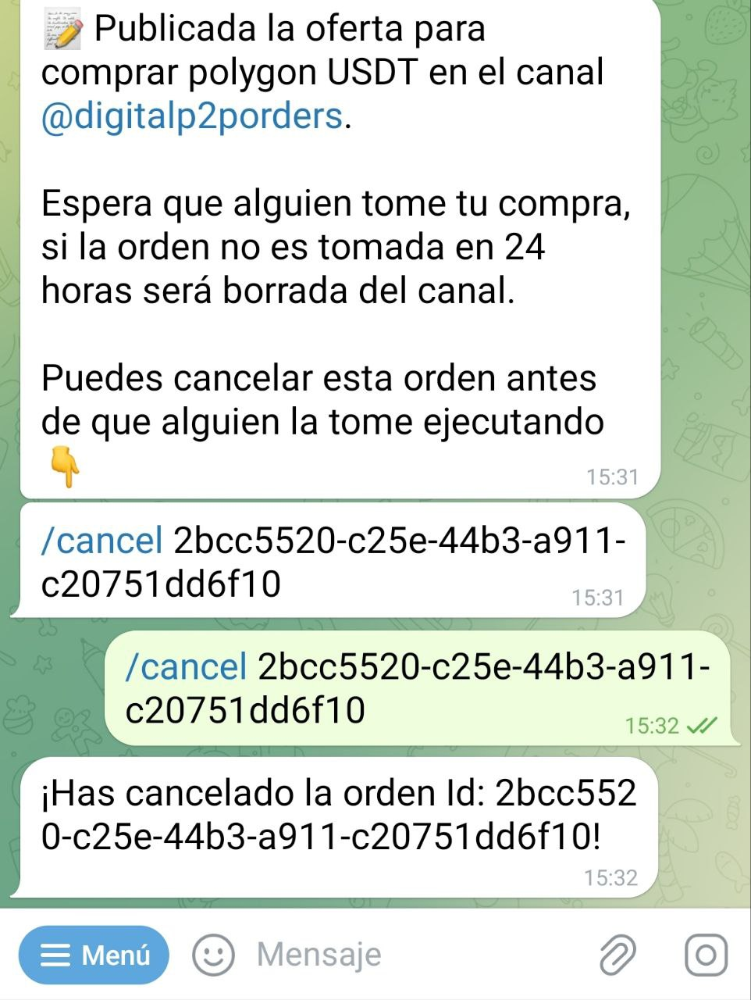

# ¿Cómo creo una orden de compra?

El procedimiento es exactamente el mismo que para la orden de venta. Solo que al pulsar el botón "Menú", debes seleccionar el comando `/buy` en lugar de `/sell`. 

Este activará el asistente (*wizard*) que te guiará por el proceso de comprar. Una vez activado, el asistente te pedirá que especifiques la moneda fíat con la que quieres transar:

A continuación deberás introducir el token (USDT-USDC), que quieres comprar. 

A continuación, deberás introducir la moneda fíat, con la que comprarar los USDT-USDC, en este caso seleccionamos el Peso Colombiano (COP). Recuerda que si tu moneda no esta, tambien la puedes escribir.

El bot te preguntará el monto, en Pesos Colombianos (COP), que quieres comprar, en este ejemplo vamos a comprar 200000 Pesos colombianos (COP). También puedes introducir un rango de cantidades a comprar, separando los números por un guion (-), ejemplo (10000-200000)

Lo siguiente que te solicita el asistente es el porcentaje de prima o descuento que quieres en tu intercambio. Si quieres aumentar la tasa de mercado (prima), selecciona un número positivo; si quieres disminuirla (descuento), selecciona un número negativo. En caso de no querer ninguna, usa el botón " Sin descuento Sin prima ".

A continuación, deberás especificar el método de pago. En este campo puedes ponerte creativo y añadir emoticones o lo que consideres para hacer atractiva tu oferta.

El bot procederá a publicar tu oferta en el canal de la comunidad. 

Esta orden permanecerá visible por 23 horas, si nadie la toma antes de ese tiempo la orden se cancela automaticamente y tendras que crear una nueva orden.

En cualquier momento puedes cancelar la oferta, siempre y cuando nadie la haya tomado, usando el comando `/cancel` seguido por el identificador de la orden. El asistente te devolverá un mensaje confirmando la cancelación y se removerá tu oferta del canal de ofertas.

En caso de que tu oferta sea tomada, el asistente te pedirá que ingreses una direccion de polygon donde recibiras los USDT-USDC. Al mismo tiempo le pedirá a tu contraparte que envie los USDT-USDC a la direccion del contrato ingeligente. 

En ese momento el bot pondrá en contacto a ambas partes para que discutan los detalles del intercambio.

Una vez que hayas hecho el pago en fíat, notifica al bot con el comando `/fiatsent`. El bot avisará a tu contraparte para que consulte y verifique la recepción del dinero, y proceda a liberar los USDT-USDC. 

El intercambio ha terminado. Ahora puedes calificar a tu contraparte.

Puedes salir del asistente en cualquier momento ejecutando el comando `/exit`.

Para ejecutar la misma orden de compra, sin usar el asistente, debes escribir tu orden con los detalles: `/buy <monto en USDT> <monto en fiat> <código fiat> <método de pago>` [prima/descuento] (sin los carácteres especiales).

Ejemplo: `/buy 50 200000 COP "Banco XYZ"`

Compro cincuenta USDT a docientos mil pesos pago por banco xyz

Algunos ejemplos de órdenes de compra serían los siguientes:

- Ej. `/buy 0 50 ves "Banco Z"`: Compro cincuenta bolívares en USDT -en este caso el bot hará el cálculo a la tasa de mercado- pago por banco Z.
- Ej. `/buy 0 10000-200000 COP "X Bank"`: Compro de 10.000 a 200.000 pesos-en este caso el vendedor elegirá qué monto venderte en ese rango- pago por X bank.
- Ej. `/buy 0 100 EUR "Euroya" -3`: Compro 100 euros descontando 3% -en este caso el bot hará el cálculo a la tasa de mercado descontando o incrementando el porcentaje que elijas- pago por Euroya.

De haber alguna variable no compatible, el bot te lo indicará durante el proceso de creación de la orden. Al completarla, la misma se publicará automáticamente en el canal de intercambio y será visible por un período de 23 horas.
