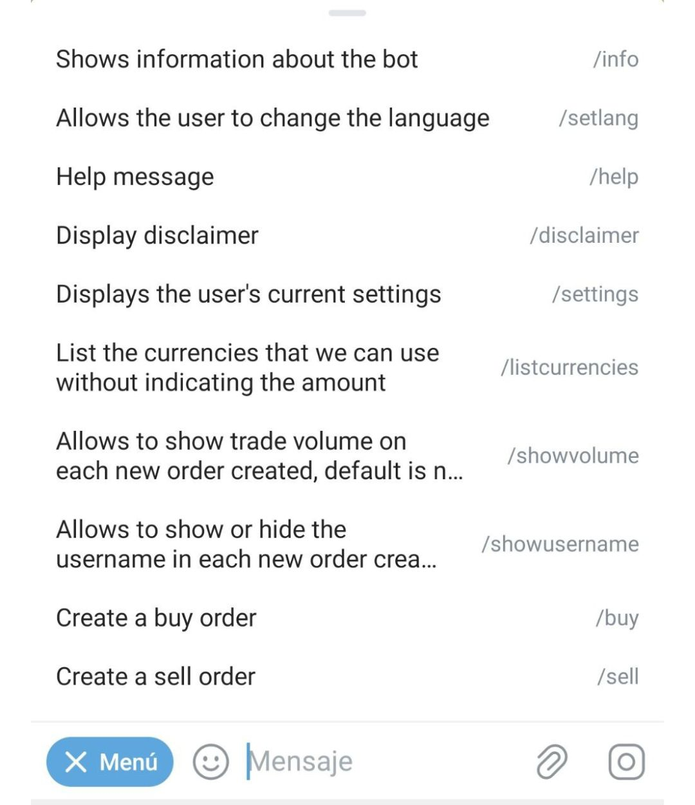
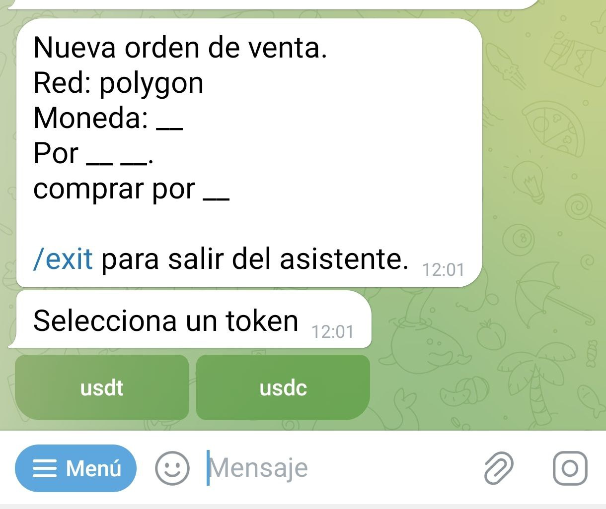
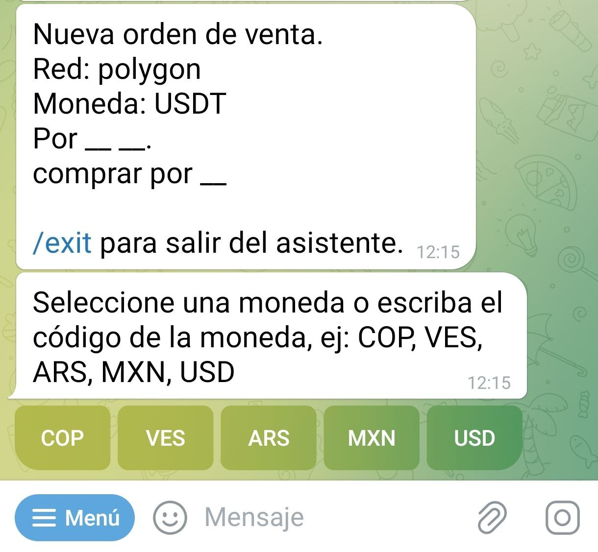
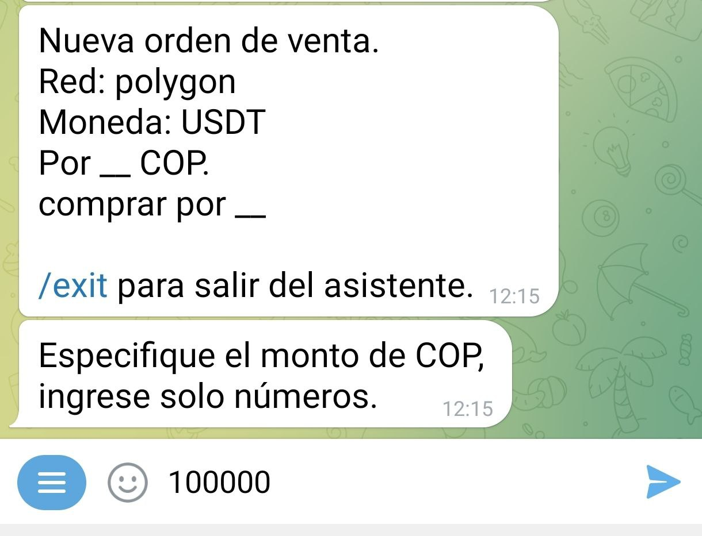
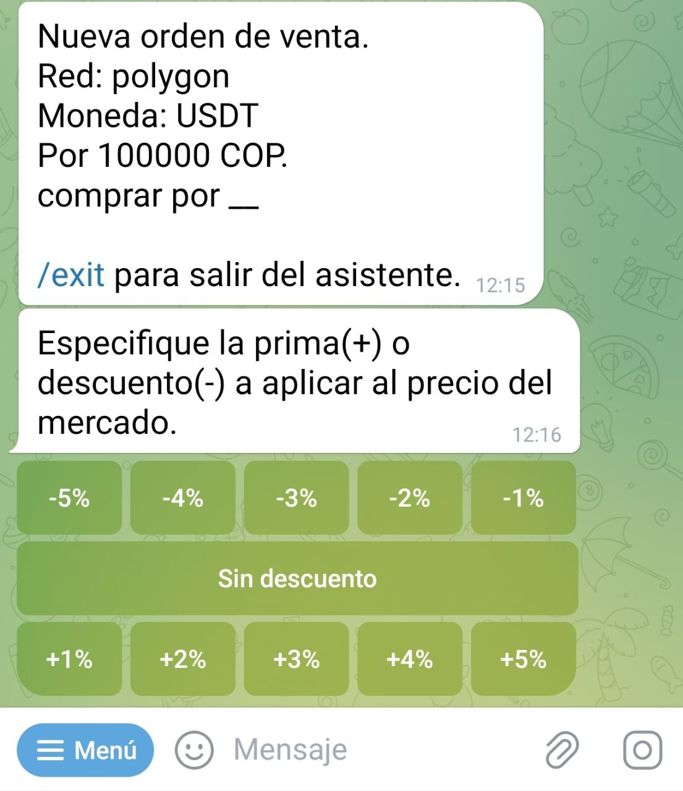
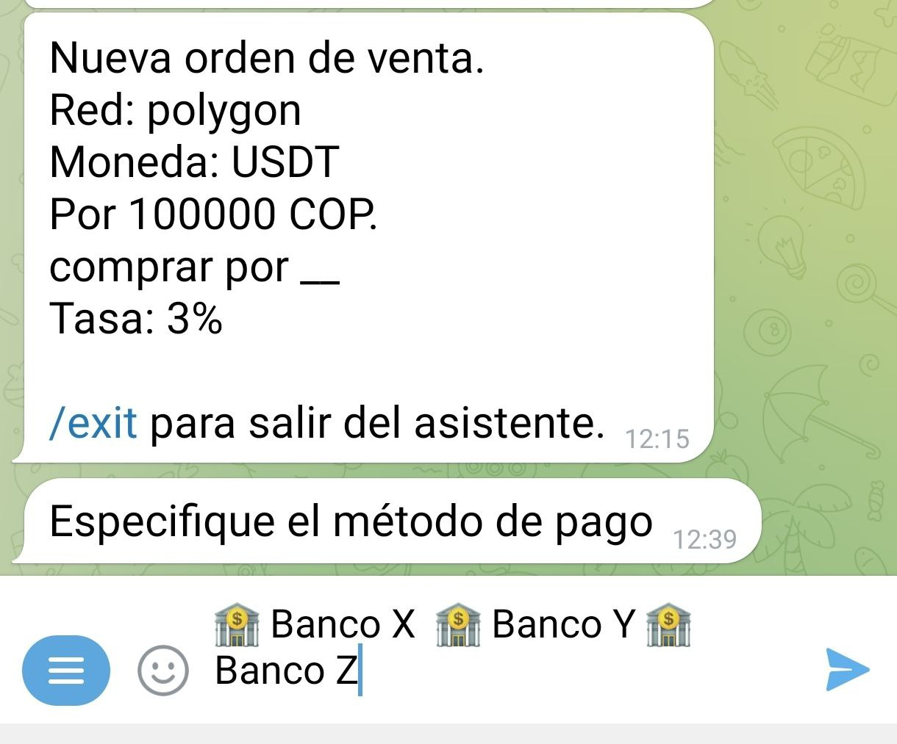
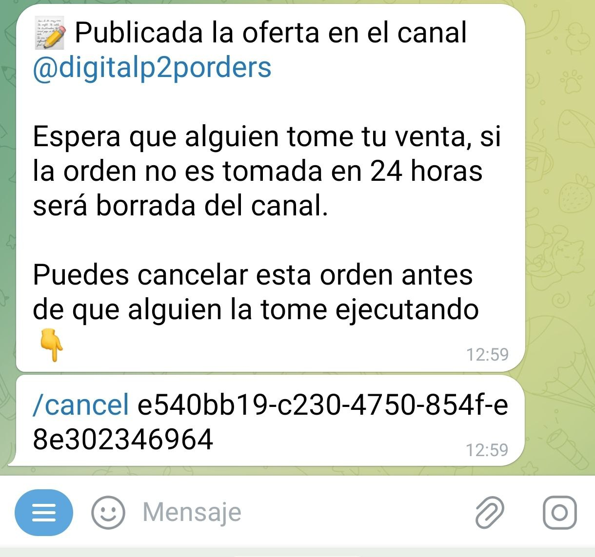
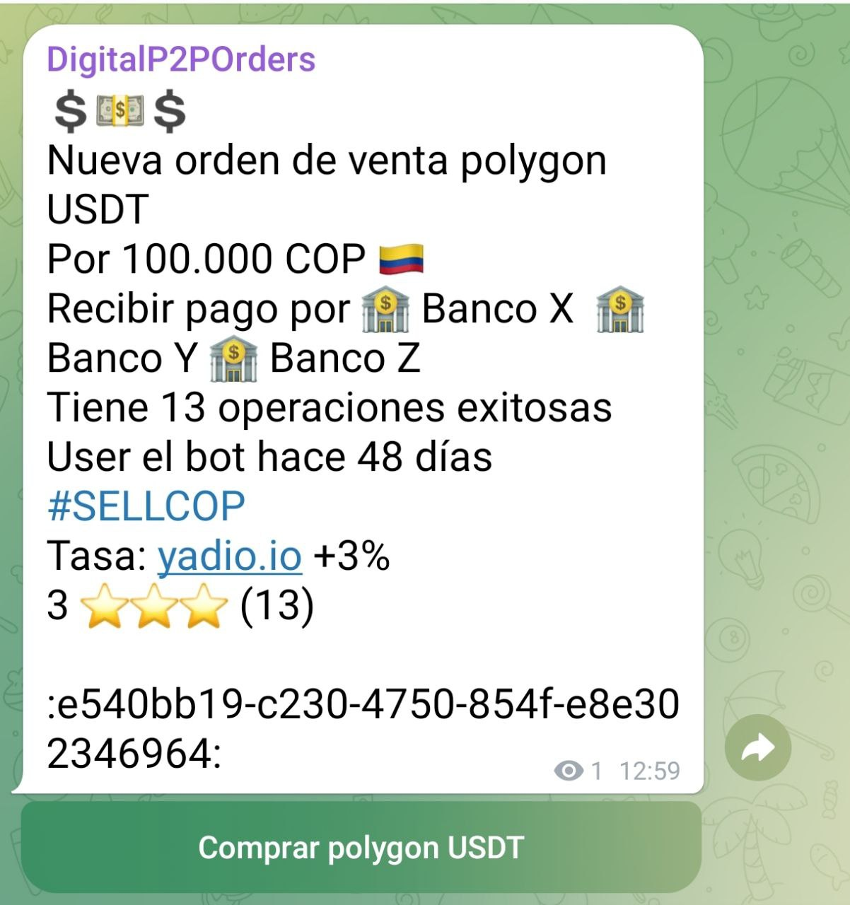
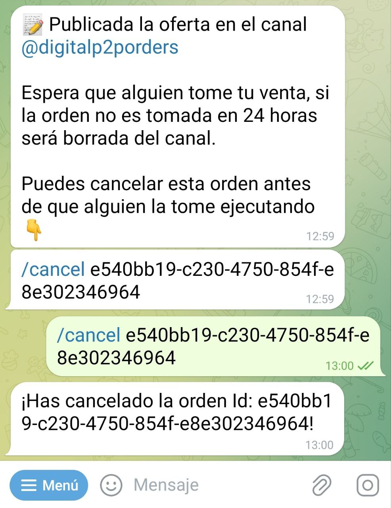

#  ¿Cómo creo una orden de venta?

Al chatear con [@DigitalP2PBot](https://t.me/DigitalP2PBot) encontrarás un botón de "Menú". Púlsalo para desplegar la lista de comandos que puedes usar. Selecciona el comando de venta: `/sell`, para activar el asistente (*wizard*) que te guiará por el proceso de vender.

Una vez activado, el asistente te pedirá que oprimas el boton del token (USDT-USDC) que quieres vender:

A continuación, deberás introducir la moneda fíat, que quieres a cambio de tus USDT-USDC, en este caso seleccionamos el Peso Colombiano (COP). Recuerda que si tu moneda no esta, tambien la puedes escribir.

El bot te preguntará el monto, en Pesos Colombianos (COP), que quieres vender, en este ejemplo vamos a vender 100000 Pesos colombianos (COP). También puedes introducir un rango de cantidades a vender, separando los números por un guion (-), ejemplo (10000-100000)

Lo siguiente que te solicita el asistente es el porcentaje de prima o descuento que quieres en tu intercambio. Si quieres aumentar la tasa de mercado (prima), selecciona un número positivo; si quieres disminuirla (descuento), selecciona un número negativo. En caso de no querer ninguna, usa el botón "Sin descuento sin prima".

A continuación, deberás especificar el método de pago. En este campo puedes ponerte creativo y añadir emoticones o lo que consideres para hacer atractiva tu solicitud.

El bot procederá a publicar tu oferta en el canal de ofertas de la comunidad. 

La oferta permanecerá visible por 23 horas en el canal de ordenes, si nadie la toma antes de ese tiempo la oferta se elimina automaticamente.

En cualquier momento puedes cancelar la oferta, siempre y cuando nadie la haya tomado, usando el comando `/cancel` seguido por el identificador de la orden. También puedes copiar el comando más el identificador en el chat con el bot. El asistente te devolverá un mensaje confirmando la cancelación y se removerá tu oferta del canal de ofertas.

En caso de que tu venta sea tomada, el bot le pedirá a tu contraparte que ingrese una direccion donde recibir los USDT-USDC.

Al mismo tiempo, te pedirá que pagues el monto de los USDT-USDC correspondiente, más una comisión del 0,6%. Recuerda que la red puede cobrarte un monto adicional. Esa cantidad dependerá de la congestion de la red. El bot no tiene que ver nada con ese monto.

En este momento el bot pondrá en contacto a ambas partes para que discutan los detalles del intercambio.

Una vez que el bot recibe el aviso de que el monto en fíat fue pagado, te envía un alerta para que revises tu cuenta. Si todo está en orden, puedes liberar los USDT-USDC con el comando `/release` seguido del identificador de transacción (o copia y pega el texto en el chat del bot) y se ejecutará la transacción.

El intercambio ha terminado. Ahora puedes calificar a tu contraparte.

Puedes salir del asistente en cualquier momento ejecutando el comando `/exit`.

Para ejecutar la misma orden de venta, sin usar el asistente, debes escribir tu orden con los detalles: `/sell <monto en USDT-USDC> <monto en fiat> <código fiat> <método de pago> [prima/descuento]` (sin los caracteres especiales).

Ejemplo: `/sell 100 400000 COP "banco xyz"` Vendo cien dolares por cuatrocientos mil pesos cobro por banco xyz

En caso de haber alguna variable no compatible, el bot te lo indicará durante el proceso de creación de la orden. Al completarla, la misma se publicará en el canal de intercambio y será visible por un período de 23 horas.
