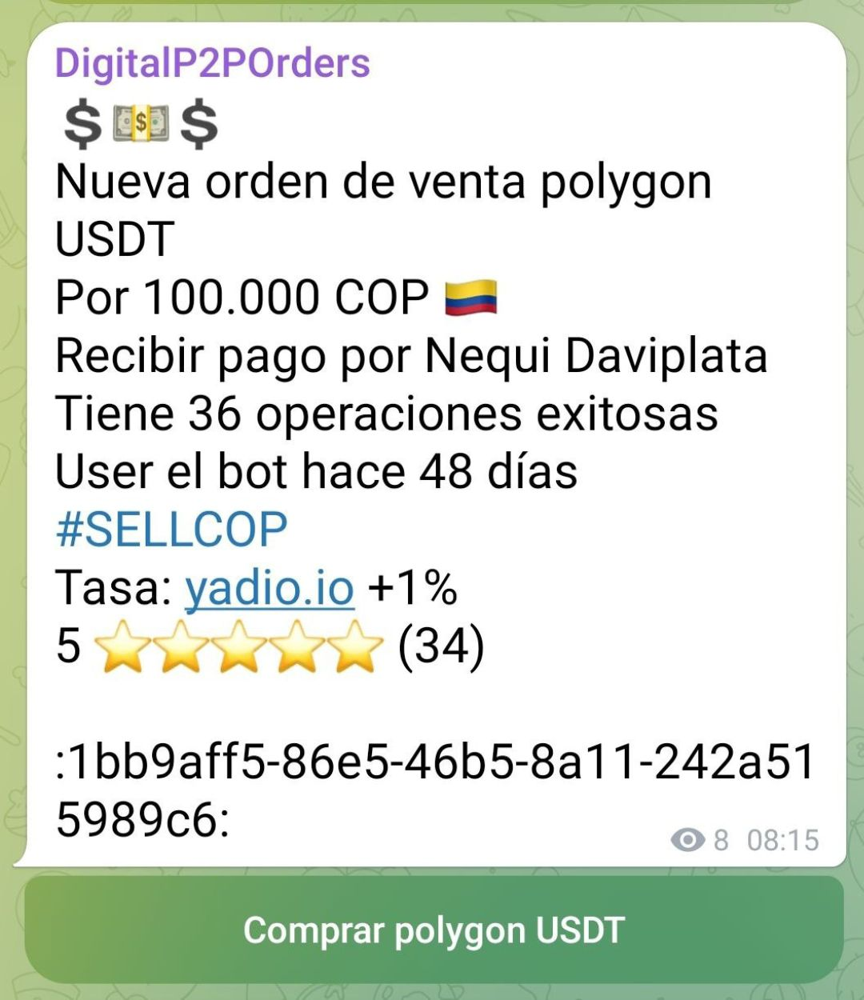

# ¿Cómo funciona el sistema de reputación de usuario?

Por cada transacción que realices se te pedirá calificar a tu contraparte, a la vez que esta te calificará a ti. Para ello, [**DigitalP2PBot**](https://t.me/DigitalP2PBot) cuenta con un sistema de puntuación de 5 estrellas que te permitirá valorar tu experiencia, donde 1 estrella es la menor calificación y 5 estrellas es la mayor. 

Para obtener la reputación el bot realiza un cálculo iterativo de la media y la desviación estándar de las calificaciones y las operaciones exitosas, por lo que en las primeras operaciones, aunque te hayan calificado con el máximo, tu reputación no será alta sino que aumentará progresivamente a medida que vayas haciendo operaciones con buenas calificaciones. 

Cuando crees una oferta, esta incluirá por defecto el número de operaciones exitosas que realizaste, las calificaciones recibidas de tus contrapartes, y el número de operaciones realizadas. Recomendamos tener en cuenta todos estos aspectos al tomar una oferta para evitar estafas.

