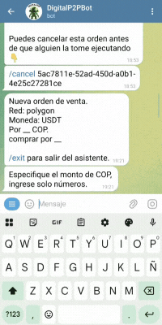
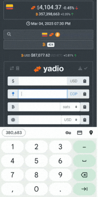

# ¿Qué tasa de cambio utiliza el bot?

Al crear una orden puedes optar por especificar solo el monto fíat a `pagar/cobrar`, y no la cantidad de USDT-USDC que deseas `comprar/vender`, y el bot hará el cálculo a tasa de mercado ofrecida por [yadio.io](https://yadio.io/) en el momento en que tu orden sea tomada.

También puedes colocar una prima o un descuento para tu oferta, esto significa que se aplicará un aumento o una disminución al precio de USDT-USDC que marque [yadio.io](https://yadio.io/) en el momento en que se tome la orden.

#### Ejemplos prácticos con su significado:

- Compro USDT  +1%: Quiero comprar USDT un 1% más caro (por encima) que el precio de USDT que marque [yadio.io](https://yadio.io/) al momento en que alguien tome mi oferta. 

- Compro USDC -5%: Quiero comprar USDC un 5% más barato (por debajo) que el precio de USDC que marque [yadio.io](https://yadio.io/) al momento en que alguien tome mi oferta.

- Vendo USDT +3%: Quiero vender USDT un 3% más caro (por encima) que el precio de USDT que marque [yadio.io](https://yadio.io/) al momento en que alguien tome mi oferta.

- Vendo USDC -4%: Quiero vender USDC un 4% más barato (por debajo) que el precio de USDC que marque [yadio.io](https://yadio.io/) al momento en que alguien tome mi oferta.
